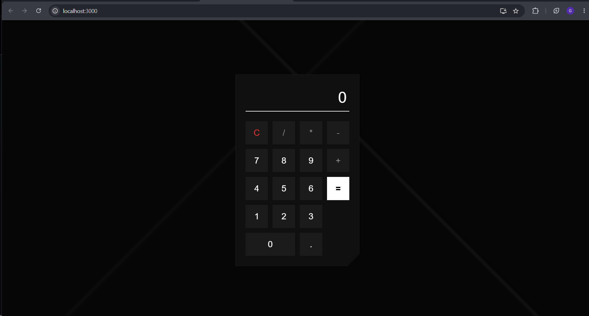

# Ex04 Simple Calculator - React Project
## Date:14-03-2026
## Name : Gopi sriram E
## Reg No : 212225230080

## AIM
To  develop a Simple Calculator using React.js with clean and responsive design, ensuring a smooth user experience across different screen sizes.

## ALGORITHM
### STEP 1
Create a React App.

### STEP 2
Open a terminal and run:
  <ul><li>npx create-react-app simple-calculator</li>
  <li>cd simple-calculator</li>
  <li>npm start</li></ul>

### STEP 3
Inside the src/ folder, create a new file Calculator.js and define the basic structure.

### STEP 4
Plan the UI: Display screen, number buttons (0-9), operators (+, -, *, /), clear (C), and equal (=).

### STEP 5
Create a new file Calculator.css in src/ and add the styling.

### STEP 6
Open src/App.js and modify it.

### STEP 7
Start the development server.
  npm start

### STEP 8
Open http://localhost:3000/ in the browser.

### STEP 9
Test the calculator by entering numbers and operations.

### STEP 10
Fix styling issues and refine content placement.

### STEP 11
Deploy the website.

### STEP 12
Upload to GitHub Pages for free hosting.

## PROGRAM

```

Calculator.js

import React, { useState } from 'react';
import './Calculator.css';

const Calculator = () => {
  const [input, setInput] = useState('');

  const handleClick = (value) => {
    setInput((prev) => prev + value);
  };

  const handleClear = () => {
    setInput('');
  };

  const handleCalculate = () => {
    try {
      // Safe evaluation of mathematical expression
      const result = new Function('return ' + input)();
      setInput(result.toString());
    } catch (error) {
      setInput('Error');
    }
  };

  return (
    <div className="calculator-container">
      <div className="background-shards"></div>
      <div className="calculator-glass">
        <div className="display-panel">
          <input type="text" value={input || '0'} disabled />
        </div>
        <div className="keypad-grid">
          <button className="btn btn-clear sharp-edge" onClick={handleClear}>C</button>
          <button className="btn btn-op sharp-edge" onClick={() => handleClick('/')}>/</button>
          <button className="btn btn-op sharp-edge" onClick={() => handleClick('*')}>*</button>
          <button className="btn btn-op sharp-edge" onClick={() => handleClick('-')}>-</button>
          
          <button className="btn sharp-edge" onClick={() => handleClick('7')}>7</button>
          <button className="btn sharp-edge" onClick={() => handleClick('8')}>8</button>
          <button className="btn sharp-edge" onClick={() => handleClick('9')}>9</button>
          <button className="btn btn-op sharp-edge" onClick={() => handleClick('+')}>+</button>
          
          <button className="btn sharp-edge" onClick={() => handleClick('4')}>4</button>
          <button className="btn sharp-edge" onClick={() => handleClick('5')}>5</button>
          <button className="btn sharp-edge" onClick={() => handleClick('6')}>6</button>
          <button className="btn btn-equal sharp-edge" onClick={handleCalculate}>=</button>
          
          <button className="btn sharp-edge" onClick={() => handleClick('1')}>1</button>
          <button className="btn sharp-edge" onClick={() => handleClick('2')}>2</button>
          <button className="btn sharp-edge" onClick={() => handleClick('3')}>3</button>
          
          <button className="btn btn-zero sharp-edge" onClick={() => handleClick('0')}>0</button>
          <button className="btn sharp-edge" onClick={() => handleClick('.')}>.</button>
        </div>
      </div>
    </div>
  );
};

export default Calculator;

```

```

Calculator.css

* {
  box-sizing: border-box;
  margin: 0;
  padding: 0;
}

body {
  background-color: #050505; /* Deep high-contrast background */
  font-family: 'Helvetica Neue', Arial, sans-serif;
  color: #fff;
  overflow: hidden;
}

.calculator-container {
  display: flex;
  justify-content: center;
  align-items: center;
  height: 100vh;
  position: relative;
}

/* Abstract shard background accents */
.background-shards {
  position: absolute;
  top: 0; left: 0; right: 0; bottom: 0;
  background: 
    linear-gradient(135deg, transparent 40%, rgba(255, 255, 255, 0.03) 40.5%, transparent 41%),
    linear-gradient(45deg, transparent 60%, rgba(255, 255, 255, 0.05) 60.5%, transparent 61%);
  z-index: 0;
}

/* Shattered glassmorphism main body */
.calculator-glass {
  position: relative;
  z-index: 1;
  background: rgba(20, 20, 20, 0.65);
  backdrop-filter: blur(16px);
  -webkit-backdrop-filter: blur(16px);
  width: 320px;
  padding: 25px;
  border: 1px solid rgba(255, 255, 255, 0.1);
  /* Angled shard cut on the bottom right corner */
  clip-path: polygon(0 0, 100% 0, 100% calc(100% - 30px), calc(100% - 30px) 100%, 0 100%);
  box-shadow: 0 20px 50px rgba(0, 0, 0, 0.5);
}

.display-panel {
  margin-bottom: 25px;
  position: relative;
}

/* Sharp, minimalist display */
.display-panel input {
  width: 100%;
  height: 70px;
  background: transparent;
  border: none;
  border-bottom: 2px solid #fff;
  text-align: right;
  padding: 10px 5px;
  font-size: 2.5rem;
  font-weight: 300;
  color: #ffffff;
  outline: none;
  letter-spacing: 2px;
}

.keypad-grid {
  display: grid;
  grid-template-columns: repeat(4, 1fr);
  gap: 12px;
}

/* Vector-style sharp minimalist buttons */
.btn {
  background: rgba(255, 255, 255, 0.05);
  color: #fff;
  border: 1px solid transparent;
  height: 60px;
  font-size: 1.4rem;
  font-weight: 200;
  cursor: pointer;
  transition: all 0.2s ease;
  border-radius: 0; /* Strictly flat/sharp edges */
}

.btn:hover {
  background: rgba(255, 255, 255, 0.15);
  border: 1px solid rgba(255, 255, 255, 0.4);
}

.btn:active {
  background: rgba(255, 255, 255, 0.3);
}

.btn-op {
  color: #888;
  font-weight: 400;
}

.btn-clear {
  color: #ff3333; /* High contrast red accent */
  font-weight: 400;
}

.btn-equal {
  background: #fff;
  color: #000;
  grid-row: span 3;
  font-weight: 600;
}

.btn-equal:hover {
  background: #e0e0e0;
}

.btn-zero {
  grid-column: span 2;
}


```
```

App.js

import React from 'react';
import Calculator from './Calculator';

function App() {
  return (
    <div className="App">
      <Calculator />
    </div>
  );
}

export default App;

```


## OUTPUT



## RESULT
The program for developing a simple calculator in React.js is executed successfully.
